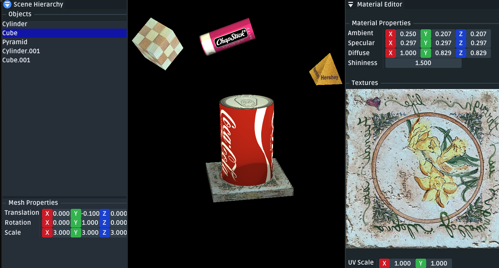

# Shaper3D

**Shaper3D** is a simple 3D model viewer built for the purpose of learning more about graphics programming with OpenGL and ImGui.

## Build Instructions

1. Clone the repository:
2. Build the cmake project using whatever method you prefer
3. Run the Shaper3D.exe
4. Create an account and log in to enter the model viewer

